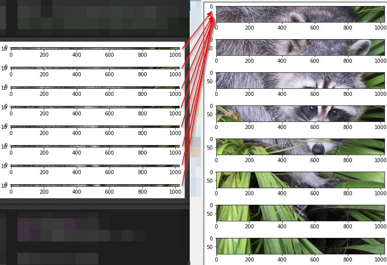
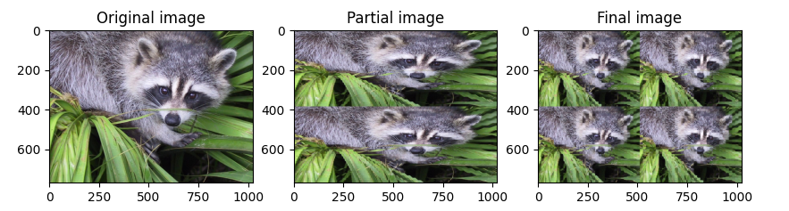

# Picture Shredding

### About
There are a lot of information on the internet about the pictures breeder for its shredding and combining accordingly.
Some say that this is a proof that we live in a simulation. 
https://www.youtube.com/watch?v=f1fXCRtSUWU  
Project mission is to try and do that same, but with Python (numpy).
“Prove that we live in a simulation” by cutting, rotating the cut images and displaying the intermediate results.

### Introduction
Progress of the project:
The picture is cut horizontally into eight equal parts. Each part is cut into eight more parts

By connecting every other patch we get two pictures.
We flip both images at a 90-degree angle and perform the splitting procedure again.
When the pictures are combined and flipped back, we have four identical pictures

### Startup procedure
- You should run a command line.
- You should write a "git clone https://github.com/ArtiGapis/PictureShredding.git" in a command line.
- Open project in your favorite editor / IDE which use a Python v3.10.
- Install the necessary libraries: 'pip install -r requirements.txt'